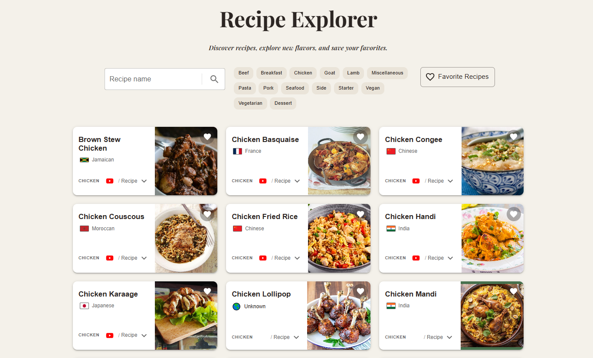

# Recipe Explorer 🍽️

A recipe discovery application built with React and Material UI, using TheMealDB API to search, filter, and explore recipes.

🔗 **Live Demo:** https://recipe-explorer-gilt.vercel.app/

## ✨ Features

- 🔎 Search recipes by name
- 🥩 Filter recipes by category
- 🌍 Explore recipes by country
- ❤️ Add and remove favorite recipes
- 📖 Expand recipe cards to view ingredients and cooking instructions
- 🎥 Open YouTube recipe videos
- 🖼️ View recipe images in a larger dialog
- 🔄 Loading, error, and empty states
- 📱 Responsive design for desktop and mobile

## 🛠️ Built With

- React
- Vite
- Material UI (MUI)
- JavaScript
- TheMealDB API
- Vercel

## 🧠 What I Practiced

This project helped me practice and strengthen:

- React state management with `useState`
- Side effects and API requests with `useEffect`
- Passing data and functions through props
- Parent-child component communication
- Conditional rendering
- Rendering dynamic lists with `.map()`
- Handling loading, error, and empty states
- Working with REST APIs
- Responsive UI design with Material UI
- Managing favorites and filtered data
- Deploying a React application with Vercel

## 🚀 Getting Started

### Prerequisites

Make sure you have Node.js installed on your machine.

### Installation

Clone the repository:

```bash
git clone https://github.com/Tncy57/recipe-explorer.git

```

Navigate to the project directory:

```bash
cd recipe-explorer
```

Install dependencies:

```bash
npm install
```

Start the development server:

```bash
npm run dev
```

The application will be available at the local development URL provided by Vite.

### Production Build

To create a production build:

```bash
npm run build
```

## 📡 API

Recipe data is provided by [TheMealDB](https://www.themealdb.com/).

The application uses TheMealDB API for:

- Recipe search
- Category filtering
- Country filtering
- Recipe details

## 📁 Project Structure

```text
src/
├── components/
│   ├── EmptyState.jsx
│   ├── ErrorState.jsx
│   ├── LoadingState.jsx
│   ├── RecipeCard.jsx
│   ├── RecipeCategoryFilter.jsx
│   └── RecipeForm.jsx
│
├── pages/
│   ├── Favorites.jsx
│   └── RecipeExplorer.jsx
│
├── App.jsx
├── main.jsx
└── theme.js
```

## 🌐 Deployment

The application is deployed with Vercel.

The project is connected to GitHub, and new commits pushed to the `main` branch automatically trigger a new deployment.

## 📸 Screenshots

### Home



## 👤 Author

**Tncy57**

GitHub: https://github.com/Tncy57/recipe-explorer
